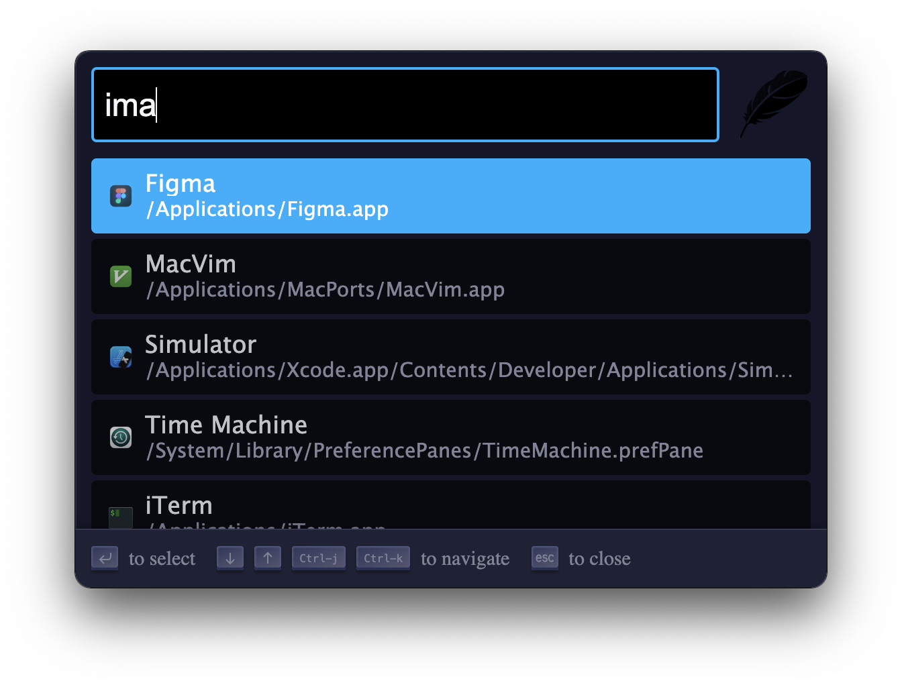
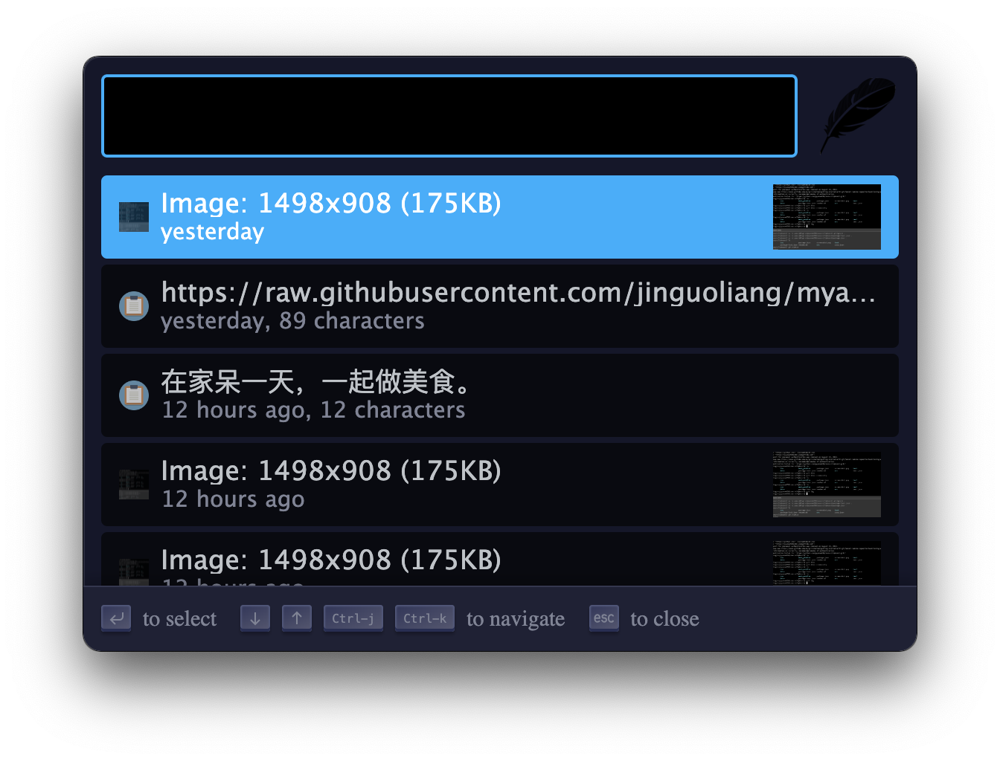

## Electron Theme

An electron site theme, written in native css.

IMPORTANT: This theme require [zazu2](https://github.com/pysnow530/zazu2).

Main View

Clipboard View

## Installing

Mark `pysnow530/zazu-electron-theme` inside of your `~/.zazurc.json` file.

~~~ json
{
  "theme": "pysnow530/zazu-electron-theme"
}
~~~

## Building

There is no need to build.
